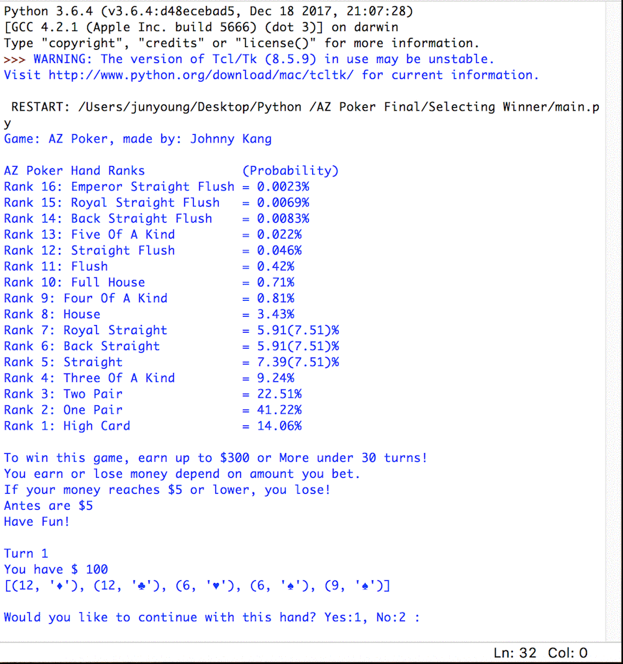

# Poker-Game-Simplified

Download all 3 files and run main.py! 
Rules are simple. Higher hand wins. Antes are $5. You earn/lose amount you bet.

Hand ranks are shown below for your information.

print ("AZ Poker Hand Ranks             (Probability)")
print ("Rank 16: Emperor Straight Flush = 0.0023%")        = A(14), K(13), Q(12), J(11), Z(15) Same Suit 
print ("Rank 15: Royal Straight Flush   = 0.0069%")        = A(14), K(13), Q(12), J(11), T(10) Same Suit 
print ("Rank 14: Back Straight Flush    = 0.0083%")        = A(14), 2    , 3    , 4    , 5     Same Suit 
print ("Rank 13: Five Of A Kind         = 0.022%")         = Four same number + Z(15)
print ("Rank 12: Straight Flush         = 0.046%")         = Any Straight hand with same suit
print ("Rank 11: Flush                  = 0.42%")          = Five same suit
print ("Rank 10: Full House             = 0.71%")          = Three same numbers + Two same number (All different Suits!)
print ("Rank 9: Four Of A Kind          = 0.81%")          = Four same numbers + Any card
print ("Rank 8: House                   = 3.43%")          = Three same numbers + Two same number
print ("Rank 7: Royal Straight          = 5.91(7.51)%")    = A(14), K(13), Q(12), J(11), T(10) Non-Same Suit
print ("Rank 6: Back Straight           = 5.91(7.51)%")    = A(14), 2    , 3    , 4    , 5     Non-Same Suit 
print ("Rank 5: Straight                = 7.39(7.51)%")    = Any 5 consecutive number hand     ex) 3,4,5,6,7
print ("Rank 4: Three Of A Kind         = 9.24%")          = Three same numbers + Any two cards
print ("Rank 3: Two Pair                = 22.51%")         = Two pairs of two same cards + Any card
print ("Rank 2: One Pair                = 41.22%")         = One pair of two cards + Any three cards
print ("Rank 1: High Card               = 14.06%")         = Does not match any of the above

